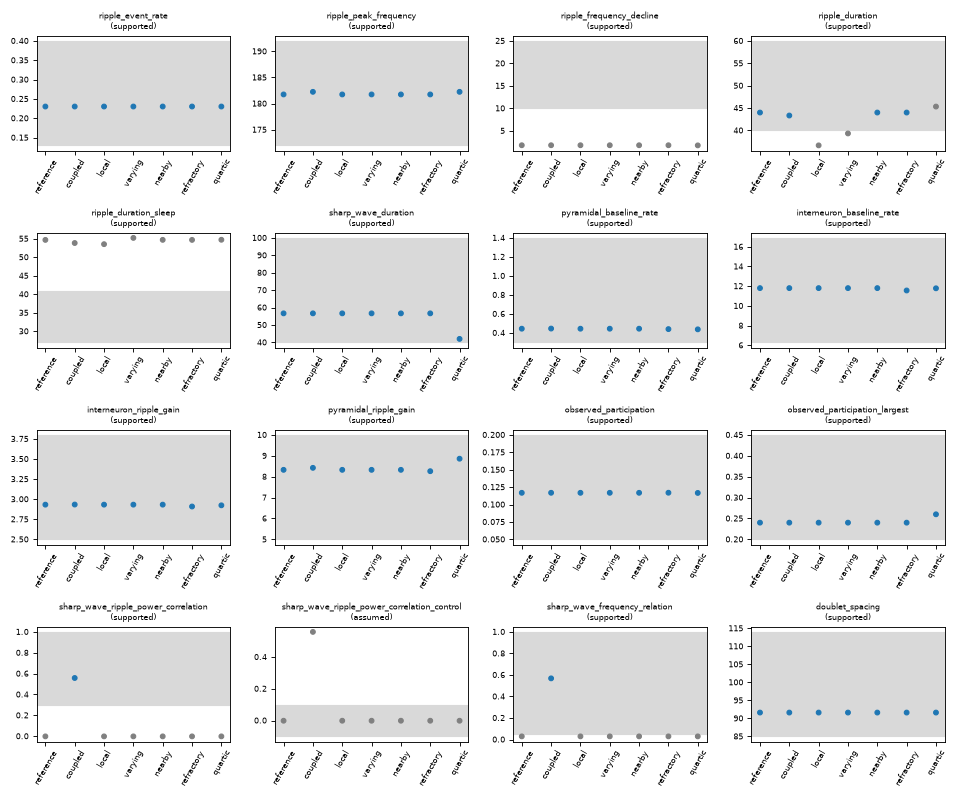
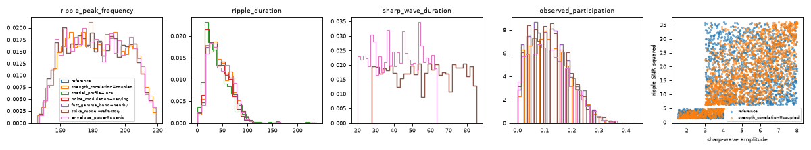
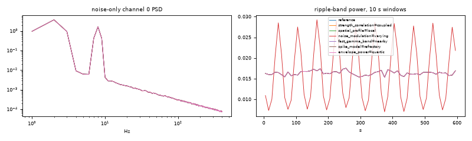
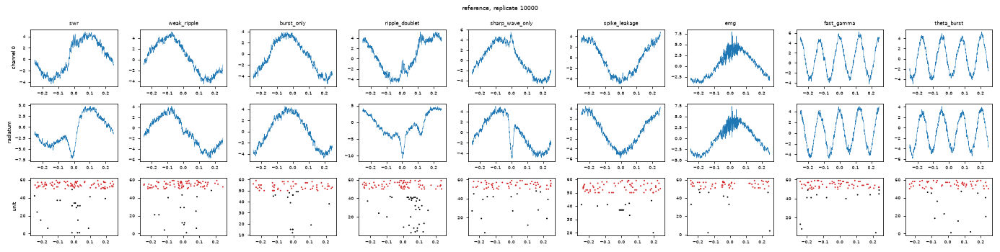
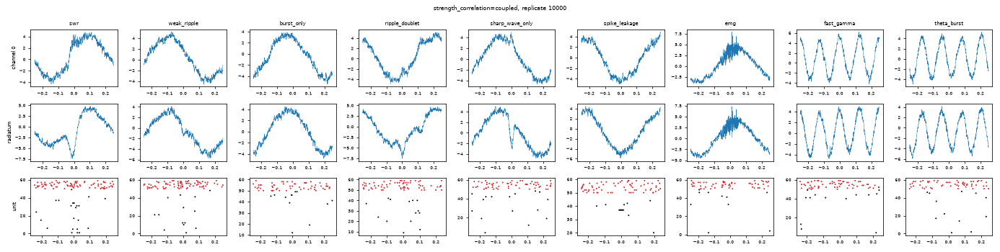
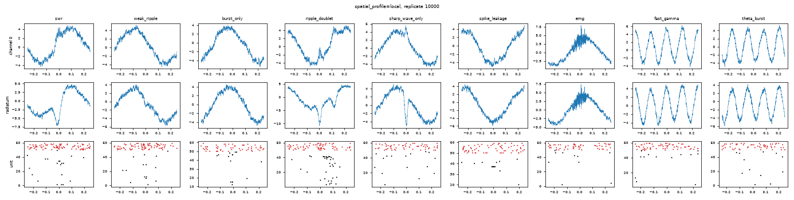
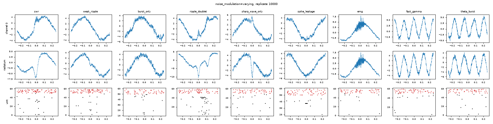
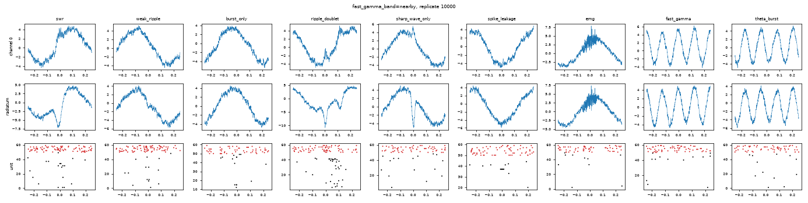
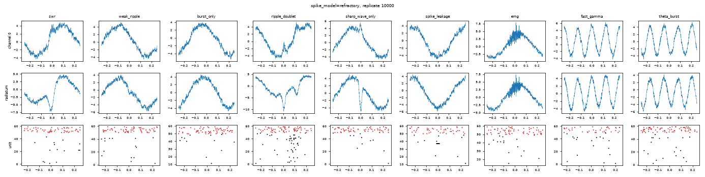
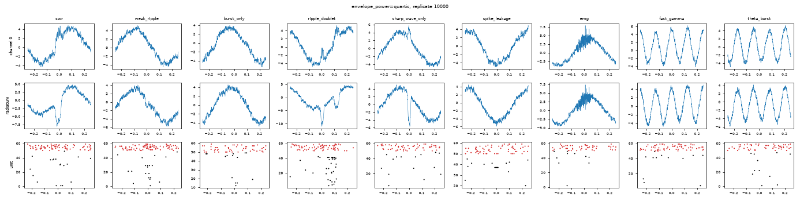

# Simulator validation `v1`

Status: **ready**. Conditions: 43; replicates 10000-10019; overrides: none; simulation fingerprint `790c102eae779c0e`; target table `00f3df24313ab7ad`.

Readiness means the rendering checks pass and every source-based target passes in the conditions it applies to. It does not certify biological realism: assumed properties stay assumed, and the stress levels of the grid are reported, not gated.

## Targets

Observed statistic pooled over the replicates; bounds include the allowance stated in the target table. Gated rows are marked `*`.

| target | evidence | statistic | bounds | reference | strength_correlation=coupled | spatial_profile=local | noise_modulation=varying | fast_gamma_band=nearby | spike_model=refractory | envelope_power=quartic |
| --- | --- | --- | --- | --- | --- | --- | --- | --- | --- | --- |
| ripple_event_rate | supported | rate_per_s | [0.13, 0.4] | 0.2304* | 0.2304* | 0.2304* | 0.2304* | 0.2304* | 0.2304* | 0.2304* |
| ripple_peak_frequency | supported | median_hz | [172, 192] | 181.8* | 182.2* | 181.8* | 181.8* | 181.8* | 181.8* | 182.2* |
| ripple_frequency_decline | supported | median_hz | [10, 25] | 1.786 (out) | 1.788 (out) | 1.786 (out) | 1.786 (out) | 1.786 (out) | 1.786 (out) | 1.758 (out) |
| ripple_duration | supported | median_ms | [40, 60] | 44* | 43.33* | 36.67 (out) | 39.33 (out) | 44* | 44* | 45.33 |
| ripple_duration_sleep | supported | mean_ms | [27, 41] | 54.67 (out) | 53.83 (out) | 53.51 (out) | 55.21 (out) | 54.68 (out) | 54.67 (out) | 54.71 (out) |
| sharp_wave_duration | supported | median_ms | [40, 100] | 56.67* | 56.67* | 56.67* | 56.67* | 56.67* | 56.67* | 42* |
| pyramidal_baseline_rate | supported | median_hz | [0.3, 1.4] | 0.444* | 0.4454* | 0.444* | 0.444* | 0.444* | 0.4397* | 0.4373* |
| interneuron_baseline_rate | supported | mean_hz | [6.3, 16.9] | 11.81* | 11.8* | 11.81* | 11.81* | 11.81* | 11.57* | 11.79* |
| interneuron_ripple_gain | supported | ratio | [2.5, 3.8] | 2.932* | 2.934* | 2.932* | 2.932* | 2.932* | 2.909* | 2.924* |
| pyramidal_ripple_gain | supported | ratio | [5, 10] | 8.328* | 8.424* | 8.328* | 8.328* | 8.328* | 8.263* | 8.861* |
| observed_participation | supported | mean_fraction | [0.05, 0.2] | 0.1169* | 0.1169* | 0.1169* | 0.1169* | 0.1169* | 0.117* | 0.1167* |
| observed_participation_largest | supported | p95_fraction | [0.2, 0.45] | 0.24* | 0.24* | 0.24* | 0.24* | 0.24* | 0.24* | 0.26* |
| sharp_wave_ripple_power_correlation | supported | pearson_r | [0.3, 1] | -0.00142 (out) | 0.5582* | -0.00142 (out) | -0.00142 (out) | -0.00142 (out) | -0.00142 (out) | -0.00142 (out) |
| sharp_wave_ripple_power_correlation_control | assumed | pearson_r | [-0.1, 0.1] | -0.00142 | 0.5582 (out) | -0.00142 | -0.00142 | -0.00142 | -0.00142 | -0.00142 |
| sharp_wave_frequency_relation | supported | spearman_r | [0.05, 1] | 0.02915 (out) | 0.5683* | 0.02915 (out) | 0.02915 (out) | 0.02915 (out) | 0.02915 (out) | 0.02915 (out) |
| doublet_spacing | supported | median_ms | [85, 114] | 91.61* | 91.61* | 91.61* | 91.61* | 91.61* | 91.61* | 91.61* |

## Rendering checks

| check | statistic | bounds | passing, of the conditions it applies to | worst |
| --- | --- | --- | --- | --- |
| noise_only_matched | max_abs_difference | [0, 0] | 43/43 | 0 |
| sharp_wave_truth_crossings | max_error_samples | [0, 1] | 43/43 | 1 |
| ripple_sizing | relative_spread | [0, 1e-06] | 43/43 | 2.34e-13 |
| ripple_nominal_snr | relative_error | [0, 0.05] | 43/43 | 0.0022 |
| spatial_profile_draws | violations | [0, 0] | 43/43 | 0 |
| channel_profile_rendering | max_relative_residual | [0, 0.01] | 42/42 | 0.0001721 |
| gamma_sizing | relative_error | [0, 0.05] | 42/42 | 0.004395 |
| noise_modulation_amplitude | absolute_error | [0, 0.05] | 43/43 | 0.007802 |
| model_metadata | violations | [0, 0] | 43/43 | 0 |
| interneuron_rate_realization | z | [-4, 4] | 43/43 | 0.9353 |
| refractory_spiking | violations | [0, 0] | 1/1 | 0 |

- `noise_only_matched`: The session equals its noise-only rendering outside every component's eight side scales (plus the local delay and 4 samples): the matched noise is identical.
- `sharp_wave_truth_crossings`: Each isolated sharp wave crosses 10%, 25% and 50% of its latent amplitude within a sample of its truth_windows bounds.
- `ripple_sizing`: Every ripple's filtered peak on its anchor channel over its SNR and anchor gain is one constant (the band noise SD it was sized against).
- `ripple_nominal_snr`: The median anchor SNR against noise-only channel 0's ripple-band SD over the nominal SNR times the anchor gain is 1.
- `spatial_profile_draws`: Every ripple's stored gains and delays follow its profile: global, every channel at gain 1 and no delay; local, the configured channel count, the anchor at gain 1 and no delay, the others within the gain range and delay limit, zero gain with zero delay.
- `channel_profile_rendering`: Every channel that carries a ripple holds the anchor waveform shifted by the stored delay and scaled by the stored gain ratio; zero-gain channels hold none.
- `gamma_sizing`: The median gamma-burst SNR, in its stored band against noise-only channel 0's SD in that band, over the drawn SNR is 1.
- `noise_modulation_amplitude`: The log amplitude of the background's slow gain, fitted to the noise-only ripple-band power, equals noise_log_amplitude (0 when stationary).
- `model_metadata`: Every event row stores the configured envelope power, every non-event power 2, gamma rows the configured sizing band and other rows none.
- `interneuron_rate_realization`: Interneuron spikes at rest outside every ripple's eight side scales, pooled over replicates, against the count their baseline rates give under the spike model (for 'refractory', p / (step (1 + m p)) with m blocked samples): z of the difference.
- `refractory_spiking`: No two drawn spikes of a unit closer than the refractory period, nor two in a sample (spikes near a leakage burst left out: leaked spikes are added after the draw).

## Stress levels (reported, not gated)

| condition | ripple_event_rate | ripple_peak_frequency | ripple_frequency_decline | ripple_duration | ripple_duration_sleep | sharp_wave_duration | pyramidal_baseline_rate | interneuron_baseline_rate | interneuron_ripple_gain | pyramidal_ripple_gain | observed_participation | observed_participation_largest | sharp_wave_ripple_power_correlation | sharp_wave_ripple_power_correlation_control | sharp_wave_frequency_relation | doublet_spacing |
| --- | --- | --- | --- | --- | --- | --- | --- | --- | --- | --- | --- | --- | --- | --- | --- | --- |
| ripple_snr=low | 0.2304 | 181.8 | 1.786 | 20 | 44.07 | 56.67 | 0.444 | 11.81 | 2.932 | 8.328 | 0.1169 | 0.24 | -0.0006773 | -0.0006773 | 0.02915 | 91.61 |
| ripple_snr=high | 0.2304 | 181.8 | 1.786 | 64 | 70.11 | 56.67 | 0.444 | 11.81 | 2.932 | 8.328 | 0.1169 | 0.24 | -0.001579 | -0.001579 | 0.02915 | 91.61 |
| participation=low | 0.2304 | 181.8 | 1.786 | 44 | 54.67 | 56.67 | 0.3959 | 11.81 | 2.941 | 3.569 | 0.05448 | 0.12 | -0.00142 | -0.00142 | 0.02915 | 91.61 |
| participation=high | 0.2304 | 181.8 | 1.786 | 44 | 54.67 | 56.67 | 0.492 | 11.81 | 2.95 | 14.13 | 0.1835 | 0.34 | -0.00142 | -0.00142 | 0.02915 | 91.61 |
| n_units=30 | 0.2304 | 181.8 | 1.786 | 44 | 54.67 | 56.67 | 0.4571 | 11.96 | 2.924 | 8.317 | 0.114 | 0.28 | -0.00142 | -0.00142 | 0.02915 | 91.61 |
| n_units=120 | 0.2304 | 181.8 | 1.786 | 44 | 54.67 | 56.67 | 0.4356 | 11.77 | 2.942 | 8.669 | 0.1149 | 0.23 | -0.00142 | -0.00142 | 0.02915 | 91.61 |
| n_channels=1 | 0.2304 | 181.8 | 1.786 | 44 | 54.66 | 56.67 | 0.444 | 11.81 | 2.932 | 8.328 | 0.1169 | 0.24 | -0.00142 | -0.00142 | 0.02915 | 91.61 |
| n_channels=16 | 0.2304 | 181.8 | 1.786 | 44 | 54.67 | 56.67 | 0.444 | 11.81 | 2.932 | 8.328 | 0.1169 | 0.24 | -0.00142 | -0.00142 | 0.02915 | 91.61 |
| shared_noise_fraction=0.2 | 0.2304 | 181.8 | 1.786 | 44 | 54.73 | 56.67 | 0.444 | 11.81 | 2.932 | 8.328 | 0.1169 | 0.24 | -0.00142 | -0.00142 | 0.02915 | 91.61 |
| shared_noise_fraction=0.8 | 0.2304 | 181.8 | 1.786 | 43.33 | 55.43 | 56.67 | 0.444 | 11.81 | 2.932 | 8.328 | 0.1169 | 0.24 | -0.00142 | -0.00142 | 0.02915 | 91.61 |
| noise_type=brown | 0.2304 | 181.8 | 1.786 | 37.33 | 57.14 | 56.67 | 0.444 | 11.81 | 2.932 | 8.328 | 0.1169 | 0.24 | -0.00142 | -0.00142 | 0.02915 | 91.61 |
| event_rate=0.15 | 0.1207 | 183 | 1.773 | 42.67 | 54.32 | 56.67 | 0.4082 | 11.66 | 3.021 | 8.945 | 0.1192 | 0.24 | 0.04386 | 0.04386 | -0.02485 | 88.58 |
| event_rate=0.6 | 0.4182 | 183.2 | 1.78 | 42.67 | 54.96 | 56.67 | 0.5072 | 12.07 | 2.915 | 8.716 | 0.1164 | 0.24 | 0.005964 | 0.005964 | 0.03211 | 88.36 |
| type_mix=swr_only | 0.2822 | 182 | 1.774 | 44 | 53.56 | 56.67 | 0.4572 | 11.83 | 3.002 | 9.483 | 0.1461 | 0.26 | -0.004398 | -0.004398 | 0.02925 | nan |
| type_mix=hard | 0.1975 | 182 | 1.752 | 42 | 56.24 | 57.33 | 0.4298 | 11.79 | 2.981 | 7.504 | 0.08492 | 0.22 | 0.03068 | 0.03068 | -0.008674 | 88.74 |
| burst_lag=0.0 | 0.2305 | 181.8 | 1.793 | 44 | 54.65 | 56.67 | 0.4496 | 11.81 | 2.893 | 9.075 | 0.1202 | 0.26 | 0.001192 | 0.001192 | 0.03063 | 91.61 |
| burst_lag=0.03 | 0.2298 | 181.8 | 1.786 | 43.33 | 54.77 | 56.67 | 0.4424 | 11.8 | 2.95 | 6.716 | 0.09691 | 0.22 | -0.003766 | -0.003766 | 0.0318 | 91.61 |
| ripple_chirp=none | 0.2304 | 189.2 | -0.002322 | 43.33 | 54.61 | 56.67 | 0.444 | 11.81 | 2.932 | 8.328 | 0.1169 | 0.24 | -0.00142 | -0.00142 | 0.02915 | 91.61 |
| spike_leakage_rate=0 | 0.2304 | 181.8 | 1.786 | 44 | 54.63 | 56.67 | 0.4382 | 11.81 | 2.948 | 8.405 | 0.1165 | 0.24 | -0.00142 | -0.00142 | 0.02915 | 91.61 |
| spike_leakage_rate=6 | 0.2304 | 181.8 | 1.786 | 44 | 54.8 | 56.67 | 0.459 | 11.81 | 2.962 | 8.182 | 0.1173 | 0.24 | -0.00142 | -0.00142 | 0.02915 | 91.61 |
| emg_rate=0 | 0.2304 | 181.8 | 1.786 | 43.67 | 53.87 | 56.67 | 0.4417 | 11.81 | 2.953 | 8.325 | 0.1169 | 0.24 | -0.00142 | -0.00142 | 0.02915 | 91.61 |
| emg_rate=3 | 0.2304 | 181.8 | 1.786 | 44 | 55.4 | 56.67 | 0.4456 | 11.81 | 2.923 | 8.371 | 0.1164 | 0.24 | -0.00142 | -0.00142 | 0.02915 | 91.61 |
| fast_gamma_rate=0 | 0.2304 | 181.8 | 1.786 | 44 | 54.7 | 56.67 | 0.4459 | 11.81 | 2.926 | 8.4 | 0.1165 | 0.24 | -0.00142 | -0.00142 | 0.02915 | 91.61 |
| fast_gamma_rate=6 | 0.2304 | 181.8 | 1.786 | 44 | 54.78 | 56.67 | 0.4427 | 11.81 | 2.943 | 8.282 | 0.1167 | 0.24 | -0.00142 | -0.00142 | 0.02915 | 91.61 |
| theta_burst_rate=0 | 0.2304 | 181.8 | 1.786 | 44 | 54.7 | 56.67 | 0.4421 | 11.81 | 2.937 | 8.565 | 0.117 | 0.255 | -0.00142 | -0.00142 | 0.02915 | 91.61 |
| theta_burst_rate=18 | 0.2304 | 181.8 | 1.786 | 44 | 54.65 | 56.67 | 0.4436 | 11.81 | 2.942 | 8.484 | 0.1169 | 0.24 | -0.00142 | -0.00142 | 0.02915 | 91.61 |
| slow_amplitude=0 | 0.2304 | 181.8 | 1.786 | 44 | 54.67 | 56.67 | 0.444 | 11.81 | 2.932 | 8.328 | 0.1169 | 0.24 | -0.00142 | -0.00142 | 0.02915 | 91.61 |
| slow_amplitude=8 | 0.2304 | 181.8 | 1.786 | 44 | 54.67 | 56.67 | 0.444 | 11.81 | 2.932 | 8.328 | 0.1169 | 0.24 | -0.00142 | -0.00142 | 0.02915 | 91.61 |
| ripple_snr=low,participation=low | 0.2304 | 181.8 | 1.786 | 20 | 44.07 | 56.67 | 0.3959 | 11.81 | 2.941 | 3.569 | 0.05448 | 0.12 | -0.0006773 | -0.0006773 | 0.02915 | 91.61 |
| ripple_snr=low,participation=high | 0.2304 | 181.8 | 1.786 | 20 | 44.07 | 56.67 | 0.492 | 11.81 | 2.95 | 14.13 | 0.1835 | 0.34 | -0.0006773 | -0.0006773 | 0.02915 | 91.61 |
| ripple_snr=high,participation=low | 0.2304 | 181.8 | 1.786 | 64 | 70.11 | 56.67 | 0.3959 | 11.81 | 2.941 | 3.569 | 0.05448 | 0.12 | -0.001579 | -0.001579 | 0.02915 | 91.61 |
| ripple_snr=high,participation=high | 0.2304 | 181.8 | 1.786 | 64 | 70.11 | 56.67 | 0.492 | 11.81 | 2.95 | 14.13 | 0.1835 | 0.34 | -0.001579 | -0.001579 | 0.02915 | 91.61 |
| ripple_snr=low,spike_leakage_rate=0 | 0.2304 | 181.8 | 1.786 | 20 | 42.76 | 56.67 | 0.4382 | 11.81 | 2.948 | 8.405 | 0.1165 | 0.24 | -0.0006773 | -0.0006773 | 0.02915 | 91.61 |
| ripple_snr=low,spike_leakage_rate=6 | 0.2304 | 181.8 | 1.786 | 20 | 45.36 | 56.67 | 0.459 | 11.81 | 2.962 | 8.182 | 0.1173 | 0.24 | -0.0006773 | -0.0006773 | 0.02915 | 91.61 |
| ripple_snr=high,spike_leakage_rate=0 | 0.2304 | 181.8 | 1.786 | 64 | 70.2 | 56.67 | 0.4382 | 11.81 | 2.948 | 8.405 | 0.1165 | 0.24 | -0.001579 | -0.001579 | 0.02915 | 91.61 |
| ripple_snr=high,spike_leakage_rate=6 | 0.2304 | 181.8 | 1.786 | 63.67 | 70.21 | 56.67 | 0.459 | 11.81 | 2.962 | 8.182 | 0.1173 | 0.24 | -0.001579 | -0.001579 | 0.02915 | 91.61 |

## Measurement choices

- Rest is the recording less its first and last second and the running bouts; rates over rest count its samples, the event rate its intervals' lengths.
- The noise-only rendering has no events and no non-events: the background is the noise and the slow field. The noise-free signal is a rendering minus it.
- Isolated components: ripples, sharp waves and gamma bursts are rendered in groups whose windows (eight side scales, the local delay and 60 ms more each side) do not overlap, so a doublet's ripples, or a long ripple and its neighbour, are measured apart. Leaving rows out redraws the carrier phases and local spatial draws of the rows after the first left out, so each isolated ripple is measured against its own rendering's ripple_channels; frequencies and widths do not depend on the phase.
- Ripple peak frequency: the largest |FFT| of the isolated ripple on its anchor channel (gain largest, delay 0) over its eight-scale window, zero-padded to 0.25 Hz resolution.
- Ripple frequency decline: the Hilbert phase derivative of the isolated anchor waveform at the samples nearest the latent centre minus and plus 7.5 ms (the modulation envelope's peak).
- Ripple duration: channel 0 of the session filtered 100-250 Hz with filter_ripple_band, its RMS in a centred window of round(0.017 fs) samples, and the run strictly above the mean plus 2 SD of the noise-only rendering's RMS (whole session) that holds the sample nearest the ripple's centre; its length is last minus first sample time (closed bounds). A ripple whose RMS is not above the threshold at its centre counts as never crossing.
- Sleep ripple duration (Patel et al.): the same run, kept when at least 20 ms long and reaching the mean plus 5 SD; over every ripple component.
- Sharp-wave width: the run of the isolated radiatum deflection at or above 10% of its sampled peak that holds the peak, last minus first sample time.
- Firing rates, ripple gains and participation count the session's spikes, leaked spikes included. Ripple-gain windows are the samples within 5 ms of each ripple centre of swr and ripple_doublet events; the baseline is rest outside every event's network window at 10% of peak.
- Observed participation: place and other pyramidal units with a spike within 25 ms of the first ripple's centre (a 50 ms window); latent recruitment (n_participants) is reported separately and never used for it.
- Correlations and doublet spacing read the rendered session's event table: the latent amplitudes, SNRs and centres the renderer drew the signals from.
- Background: Welch PSD of noise-only channel 0 (1 s segments); ripple-band power in consecutive 10 s windows; the noise modulation's log amplitude from a least-squares sinusoid at the configured period through the windows' log power, divided by 2 and by the window's averaging gain sinc(W/T).
- SNR: nominal is the table's amplitude; anchor SNR the filtered peak of the isolated anchor waveform over the ripple-band SD of noise-only channel 0; recording-wide SNR the mean over channels of each channel's filtered peak over that channel's noise SD; event-local SNR uses the SD within 5 s of the ripple's centre.
- Spike counts: variance over mean of each unit's counts in 10 ms bins wholly at rest; inter-spike intervals and population silent gaps (between consecutive spikes of any unit of the population) within each stretch of rest.

## Limitations

- Every property whose target is `assumed`, and every simulator parameter the draw_network_events Notes mark as assumed, remains an assumption.
- The reference draws event strengths independently: its lack of coupling between sharp-wave and ripple magnitude is an assumed control, not physiology.
- Ripples chirp linearly and only downward; recorded ripples fall faster around the peak and a quarter rise (ripple_frequency_decline is reported, not gated).
- Correlations, doublet spacing and the sharp-wave width check what the rendered event table carries more than the rendering itself.
- A Hilbert envelope of a sampled carrier differs from the modulation envelope; the ripple_hilbert_* measurements report by how much.

## Parameter revisions

| parameter | previous | revised | reason | evidence |
| --- | --- | --- | --- | --- |
| `events.ripple_duration` | [0.03, 0.15] | [0.042, 0.21] | The nominal 30-150 ms span read Buzsaki 2015's ripple durations, whose convention is unstated, as a span at three side scales. Measured by the ripple_duration target's convention (a 17 ms RMS of the 100-250 Hz band above the noise mean plus 2 SD), those spans gave swr ripples a median of 34 ms, below the target's 40-60 ms. The range is scaled by the smallest factor, on a 0.1 grid from 1.0 to 2.0, whose median lies inside the target by at least two bootstrap standard errors: 1.4. SNR and every other value are unchanged. | Calibration on the reference with replicates 20000-20019, separate from the report's, 600 s each, no detector run; median of the swr ripples' durations that cross (standard error): x1.0 33.3 ms (0.64), x1.3 40.0 (0.71), x1.4 42.7 (0.82), x2.0 56.0 (1.16). The first report, on 5 replicates, gave 34 ms. |
| `events.burst_gain` | 40.0 | 34.0 | The gain of 40 was assumed, taken from examples/literature_recipes.py. After the ripple span revision, longer bursts put the pyramidal_ripple_gain ratio at the target's upper bound (reference 9.96, coupled 10.00, quartic 10.17 against 5-10). The gain is set, on a grid of whole numbers from 30 to 40, to the value whose reference ratio is closest to the source's reported mean, 8.6 (Csicsvari et al. 1999, p. 278): 34. | Calibration on the reference with the revised spans, replicates 20000-20019, 600 s each, no detector run, the ratio pooled as the report pools it: gain 33 8.25, 34 8.64, 35 8.96, 40 10.21. The 20-replicate report with gain 40 gave 9.96. |

Session time: 10060.8 s over 860 sessions.

